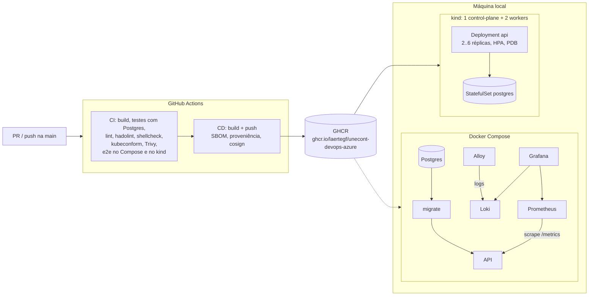

# RealWorld API: infraestrutura DevOps

[](https://github.com/laertegf/unecont-devops-azure/actions/workflows/ci.yml)
[](https://github.com/laertegf/unecont-devops-azure/actions/workflows/cd.yml)

Containerização, Kubernetes local, pipeline CI/CD, observabilidade e automação para uma API REST
em Node.js. A aplicação é a [RealWorld Node/Express/Prisma](https://github.com/gothinkster/node-express-realworld-example-app)
(Express + Prisma + PostgreSQL), usada como base. O foco aqui é a infraestrutura; as mudanças na
aplicação foram só as necessárias para ela ser operável (ver [Mudanças na aplicação](#mudanças-na-aplicação)).

Tudo roda local ou em serviço gratuito: Docker, kind, GitHub Actions e GHCR.

## Visão geral



| Entrega | Onde | Como rodar |
|---|---|---|
| 1. Docker | [`Dockerfile`](Dockerfile), [`docker-compose.yml`](docker-compose.yml) | `docker compose up -d --build` |
| 2. Kubernetes local | [`k8s/`](k8s) (kustomize) | `scripts/kind-up.sh` |
| 3. CI/CD | [`.github/workflows/`](.github/workflows) | abrir um PR / push na `main` |
| 4. Observabilidade | [`observability/`](observability) | `docker compose --profile observability up -d` |
| 5. Script | [`scripts/deploy.sh`](scripts/deploy.sh) | `scripts/deploy.sh <imagem>` |

## Pré-requisitos

Docker Desktop, [kind](https://kind.sigs.k8s.io), kubectl e um shell bash (no Windows, o Git Bash).

```bash
cp .env.example .env    # troque as senhas; o .env não vai para o git
```

## 1. Docker

**Dockerfile** com build em 3 estágios sobre `node:22-slim`:

| Estágio | O que faz | Vai para a imagem final? |
|---|---|---|
| `build` | `npm ci` completo, `prisma generate`, build com Nx/esbuild | não |
| `prod-deps` | só dependências de produção + CLI do Prisma | só `node_modules` |
| `runtime` | código compilado + dependências | sim |

Decisões:

- **Usuário não-root** (`node`, uid 1000), com os arquivos da aplicação pertencendo ao root: o processo
  não consegue alterar o próprio código. Combina com `read_only: true` no Compose e `readOnlyRootFilesystem` no Kubernetes.
- **Mesma base em todos os estágios (Debian slim).** O Prisma escolhe o engine nativo pela libc/OpenSSL no
  `prisma generate`; buildar em uma base e rodar em outra é a causa clássica de "engine not found".
- **Uma imagem, dois usos**: a mesma imagem roda a API e o `prisma migrate deploy`. Schema e código nunca ficam fora de sincronia.
- **Configuração só por variável de ambiente** (`DATABASE_URL`, `JWT_SECRET`, `PORT`, `LOG_LEVEL`...), sem segredo com valor padrão.
- **Contexto de build mínimo** (`.dockerignore` em modo allowlist): `.env`, `.git` e testes nunca entram na imagem.
- `HEALTHCHECK` na imagem para o Docker/Compose; no Kubernetes valem as probes.

**docker-compose.yml**: a ordem de subida é garantida por healthcheck, não por `sleep`:

```
postgres (healthy) → migrate (termina com sucesso) → api (healthy)
```

```bash
docker compose up -d --build
docker compose ps
scripts/smoke-test.sh http://localhost:3000   # cadastro, artigo, tags, métricas
```

## 2. Kubernetes local (kind)

```bash
scripts/kind-up.sh            # usa a imagem publicada no GHCR
scripts/kind-up.sh --local    # ou builda localmente e carrega no kind
```

Cluster com 1 control-plane e 2 workers ([`k8s/kind-cluster.yaml`](k8s/kind-cluster.yaml)); a API fica em
`http://localhost:8080` via NodePort. O script instala o metrics-server (necessário para o HPA), gera os
segredos locais e aplica o overlay `k8s/overlays/kind`.

| Recurso | Detalhes |
|---|---|
| Deployment `api` | 2 réplicas iniciais; rolling update com `maxUnavailable: 0`; espalhado entre nós (`topologySpreadConstraints`) |
| Probes | **startup** `/healthz` (até 60s para subir) · **liveness** `/healthz` (processo vivo, não olha o banco) · **readiness** `/readyz` (checa o banco) |
| Migração | `initContainer` com `prisma migrate deploy` (idempotente, advisory lock no Postgres) |
| ConfigMap / Secret | gerados pelo kustomize com hash no nome: mudar config dispara rollout sozinho. Segredos em arquivo local fora do git |
| HPA | CPU 60% do request, 2 a 6 réplicas; sobe rápido e desce devagar (`behavior`) |
| PDB | `minAvailable: 1` durante drain de nó |
| Segurança | namespace com Pod Security `restricted`, não-root, rootfs read-only, sem capabilities, seccomp, sem token de ServiceAccount |
| NetworkPolicy | Postgres só aceita conexão dos pods da API |
| Graceful shutdown | `preStop` de 5s + a app trata SIGTERM (readiness 503, fecha conexões, encerra) |

Por que **liveness não checa o banco**: se o Postgres cai, reiniciar todos os pods não resolve nada e ainda
soma um restart em massa ao incidente. Quem tira o pod do tráfego é a readiness.

Por que **sem limit de CPU**: limit de CPU gera throttling e latência mesmo com o nó ocioso. O request
garante o agendamento e é a base do HPA; memória tem limit.

Demonstração do HPA:

```bash
scripts/load-test.sh 8 180                  # carga de dentro do cluster
kubectl -n realworld get hpa api --watch
```

## 3. Pipeline CI/CD (GitHub Actions)

**[CI](.github/workflows/ci.yml)**: todo pull request (e reaproveitado pelo CD). 4 jobs em paralelo:

| Job | O que valida |
|---|---|
| App | build, testes unitários com **Postgres real** como service container, migrations, lint do código novo (bloqueia) e do herdado (informativo) |
| Lint de infraestrutura | hadolint (Dockerfile), shellcheck (scripts), actionlint (workflows), `docker compose config`, kustomize + kubeconform (manifests) |
| Imagem + Compose e2e | build, Trivy (bloqueia CRITICAL com correção), sobe o Compose com observabilidade, smoke test, confere não-root, confere que logs chegaram no Loki e métricas no Prometheus |
| Kubernetes e2e | cluster kind no runner, deploy com o mesmo `kind-up.sh`, smoke test, HPA lendo métricas, **`deploy.sh` testado nos dois caminhos: sucesso e rollback automático** |

**[CD](.github/workflows/cd.yml)**: push na `main` roda o CI inteiro e só então publica no GHCR:

- tags `sha-<commit>` (imutável, usada em deploy/rollback), `main`/`latest` e semver em tags `v*`;
- SBOM e atestado de proveniência gerados no build;
- assinatura **cosign keyless** (OIDC do GitHub, sem chave para guardar);
- autenticação no GHCR pelo `GITHUB_TOKEN` com `packages: write` (sem PAT).

Boas práticas nos workflows: actions de terceiros fixadas por **SHA de commit**, `permissions` mínimas por
job, `concurrency` para cancelar execuções antigas de PR, cache de camadas do BuildKit no GHA e Dependabot
mantendo actions, imagem base e npm atualizados.

Sobre o lint da aplicação: o código original tem 33 erros de ESLint (`any`, `@ts-ignore`...). O código que eu
adicionei precisa passar e bloqueia o PR; o legado aparece no resumo do job sem bloquear. CI sempre vermelho
por dívida antiga perde o valor de sinal.

## 4. Observabilidade

```bash
docker compose --profile observability up -d --build
```

| Serviço | URL | Papel |
|---|---|---|
| Grafana | http://localhost:3001 | dashboard **RealWorld API** já provisionado (usuário/senha do `.env`) |
| Prometheus | http://localhost:9090 | scrape do `/metrics` da API (descoberta por DNS: pega todas as réplicas) |
| Loki | http://localhost:3100 | armazenamento de logs |
| Alloy | http://localhost:12345 | coleta os logs dos containers pelo socket do Docker (sucessor do Promtail) |

A API loga **uma linha JSON por requisição** (`level`, `method`, `route`, `status`, `duration_ms`) e expõe
métricas Prometheus: `http_requests_total`, `http_request_duration_seconds` (histograma) e as métricas padrão
do Node (CPU, memória, event loop). O label de rota usa o template (`/api/articles/:slug`), nunca a URL crua,
para não explodir a cardinalidade.

No Alloy, só `level` vira label do Loki (poucos valores possíveis); status, rota e latência ficam no corpo e são
extraídos na consulta com `| json`.

O dashboard traz requisições/s, taxa de 5xx, latência p50/p95/p99, memória, CPU, event loop lag, volume de
logs por nível, erros e o stream de logs. Para ver os erros acontecendo:

```bash
docker compose stop postgres     # API passa a responder 500 e /readyz 503
curl -s localhost:3000/api/tags
docker compose start postgres
```

## 5. Script de automação: deploy com rollback automático

[`scripts/deploy.sh`](scripts/deploy.sh) publica uma imagem num Deployment, espera o rollout e, se falhar,
volta para a revisão que estava no ar. As decisões estão comentadas no próprio script.

```bash
scripts/deploy.sh ghcr.io/laertegf/unecont-devops-azure:sha-<commit>   # deploy normal
scripts/deploy.sh ghcr.io/laertegf/unecont-devops-azure:nao-existe -t 60s   # falha → rollback
kubectl -n realworld rollout history deployment/api
```

- O sucesso é decidido pelo `kubectl rollout status`, que só termina quando as réplicas novas passam na
  readiness probe. As probes são o teste de saúde do deploy.
- O rollback usa `--to-revision` com a revisão anotada **antes** do deploy, e não um `undo` cego.
- Diagnóstico (motivo de espera dos pods e eventos de Warning) é coletado **antes** do rollback, senão se perde.
- Códigos de saída distintos para o pipeline: `0` ok, `1` pré-condição, `2` falhou e voltou, `3` falhou e não voltou.
- Atualiza API e initContainer de migração juntos (mesmo artefato).

## Mudanças na aplicação

Só o necessário para operar a API em container e Kubernetes (`src/main.ts` e `src/app/observability/`):

- `/healthz` (liveness) e `/readyz` (readiness, checa o banco);
- `/metrics` com `prom-client`;
- log estruturado em JSON por requisição, e erros 5xx logados com stack;
- desligamento gracioso no SIGTERM (readiness passa a 503, fecha o servidor e o pool do Prisma).

## Em produção, o que eu faria diferente (Azure)

| Aqui | Em produção |
|---|---|
| kind | **AKS** com node pools separados (sistema/aplicação), autoscaler de nós, zonas de disponibilidade |
| Postgres no cluster | **Azure Database for PostgreSQL Flexible Server** com HA, backup e acesso por Private Endpoint |
| Secret gerado localmente | **Azure Key Vault** + Secrets Store CSI Driver, autenticação por **Workload Identity** |
| GHCR | **ACR** com integração ao AKS, geo-replicação e quarentena/scan (Defender for Containers) |
| `kubectl` no pipeline | **GitOps** (Argo CD ou Flux) com promoção dev → hml → prod por PR; GitHub Actions autenticando no Azure por **OIDC** (sem client secret) |
| rollout do Deployment | canary/blue-green com Argo Rollouts ou Flagger, analisando métricas de erro/latência |
| NodePort | Application Gateway for Containers ou ingress gerenciado, TLS com cert-manager, WAF |
| Stack no Compose | **Azure Monitor managed Prometheus + Azure Managed Grafana**, ou a mesma stack LGTM no cluster com Loki em Blob Storage; alertas por SLO (taxa de erro, p95) |
| Segurança | políticas de admissão (Azure Policy/Kyverno) exigindo imagem assinada e do registry interno, imagem distroless, NetworkPolicy default-deny |
| App | remover o fallback de `JWT_SECRET` do código (hoje cai em um valor fixo se a variável faltar) e tracing com OpenTelemetry |

## Estrutura

```
.
├── Dockerfile, .dockerignore
├── docker-compose.yml, .env.example
├── k8s/
│   ├── kind-cluster.yaml
│   ├── base/                 # namespace, postgres, deployment, service, hpa, pdb, networkpolicy
│   └── overlays/kind/        # NodePort + secretGenerator
├── observability/            # prometheus, loki, alloy, grafana (datasources + dashboard)
├── scripts/                  # deploy.sh, kind-up.sh, kind-down.sh, load-test.sh, smoke-test.sh
├── .github/workflows/        # ci.yml, cd.yml
├── docs/demo.md              # roteiro da apresentação
└── src/                      # aplicação (upstream RealWorld + observabilidade)
```
